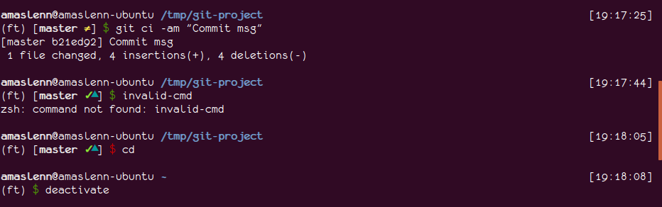

# Oh-My-Zsh theme

  

Theme is based on `bureau.zsh-theme` with small changes:
 - git status moved to the left
 - changed unicode symbols for `git status` to work best with [Monofur](http://www.dafont.com/monofur.font)
 - removed leading `>`, color of `$` depends on last return code
 - paint current path blue

